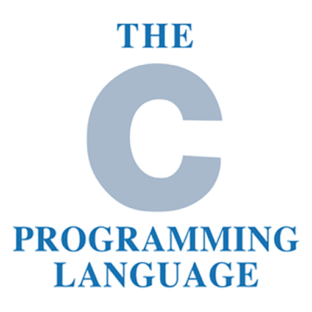
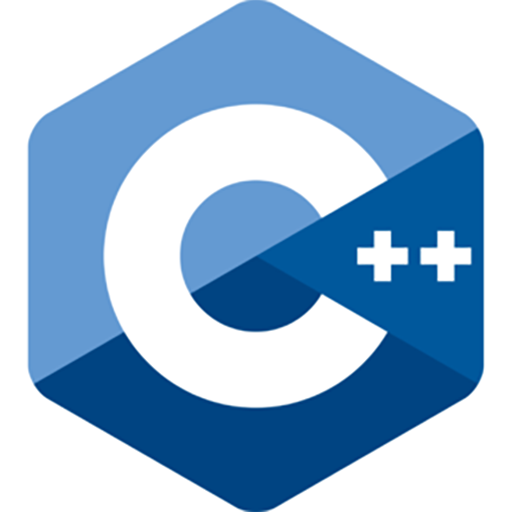
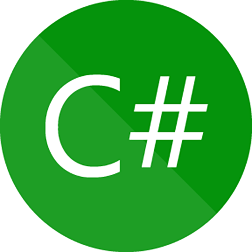
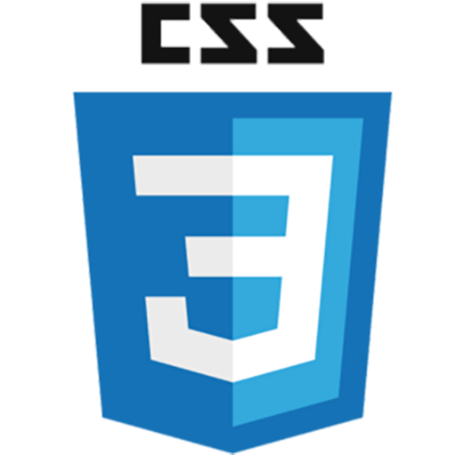
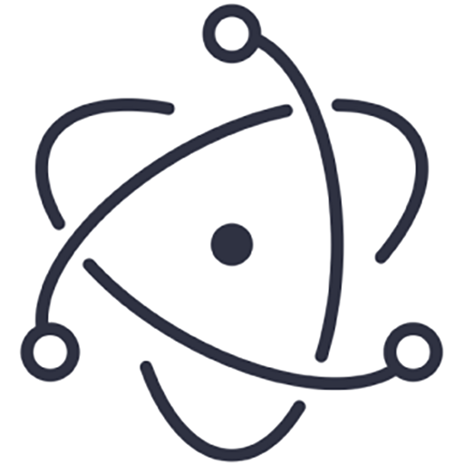
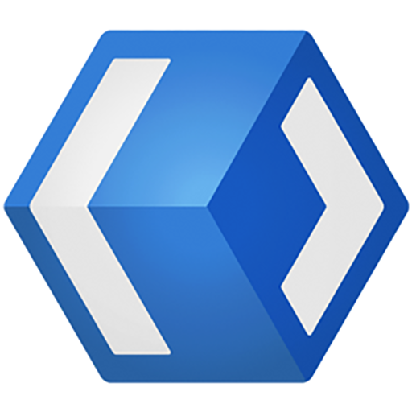
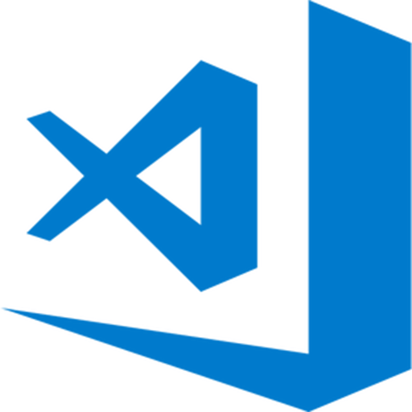
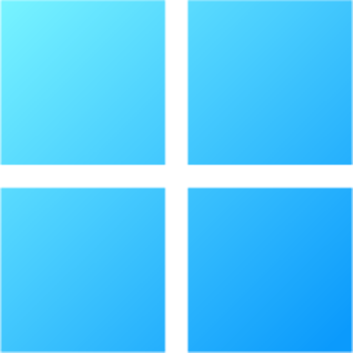
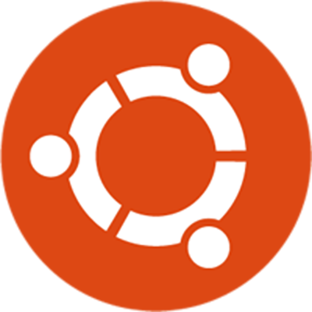
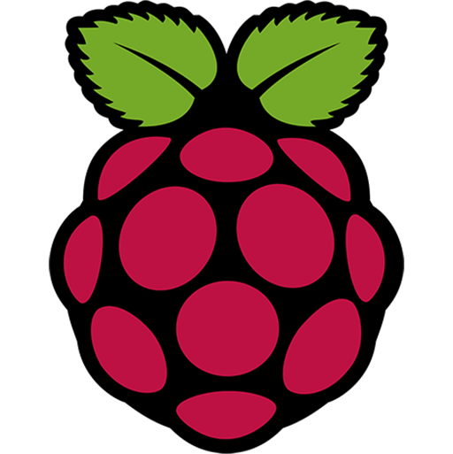

# Hi there 👋 I'm [司晓龙 | SI-Xiaolong](https://sixiaolong.win/)

  

    
  

	

- Graduated in 2024 with a degree in Material Science and Engineering from North China University of Technology (NCUT).

---

### 🔭Work

- [See My Server](https://github.com/SIXiaolong1117/SeeMyServer)：一款服务器监控软件，使用 WinUI3。
- [远程工具箱 (Remote Toolbox)](https://github.com/SIXiaolong1117/WinWoL)：一个集成网络唤醒、远程桌面 (RDP)、SSH指令/脚本的远程工具箱 (Remote Toolbox)，使用 WinUI3。
- [网关切换器 (Gateway Switcher)](https://github.com/SIXiaolong1117/NetworkSelector)：一个 Windows 网络配置切换器，可以在多个预设配置间快速切换，使用 WinUI3。
- [图片转 Base64（Pic to Base64）](https://github.com/SIXiaolong1117/vue-pictobase64)：一个图片转 Base64 编码的工具，使用 Vue + Electron。
<!-- - [𝓛𝓲𝓷𝓴 𝓒𝓸𝓵𝓵𝓮𝓬𝓽𝓲𝓸𝓷](https://github.com/SIXiaolong1117/LinkCollection)：一个纯前端静态页面实现的社交链接整合网页，基于 Vue。 -->

	

<!-- ---

### 🪛Language

<code></code>
<code></code>
<code></code>
<code></code>
<code></code>
<code></code>
<code></code>
<code></code>
<code></code>

### 🔧Framework

<code></code>
<code></code>
<code></code>

### 🧰Tools and Environment

<code></code>
<code></code>
<code></code>

### ⚙️Operating System

<code></code>
<code></code>
<code></code>
<code></code>

### 🔨Hardware

<code></code>
<code></code>
<code></code>

 -->