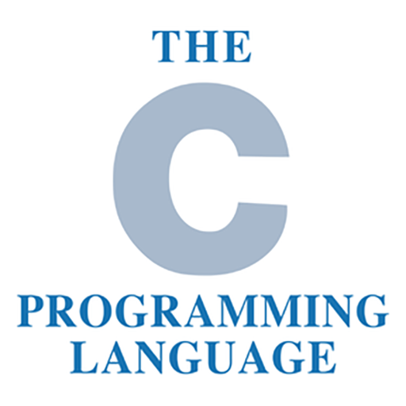
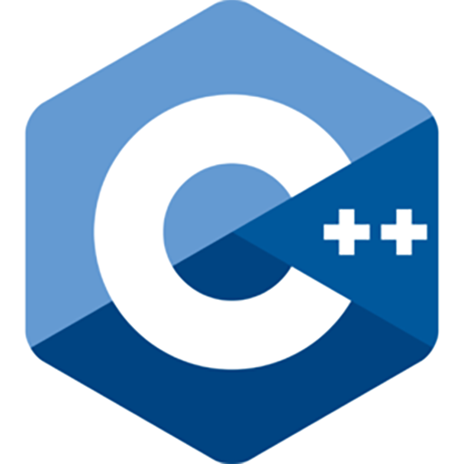
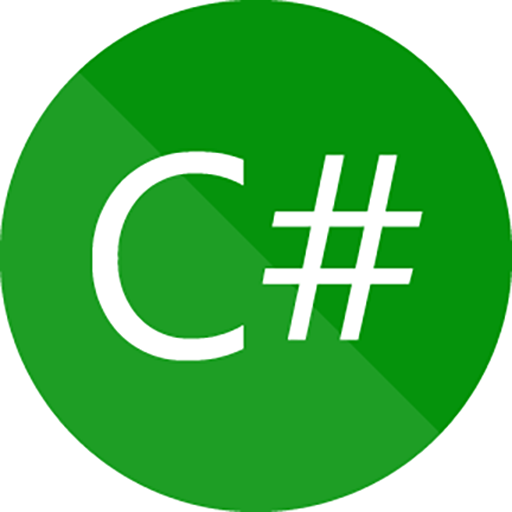
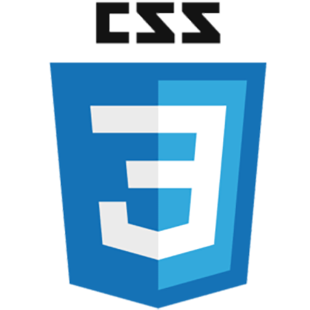
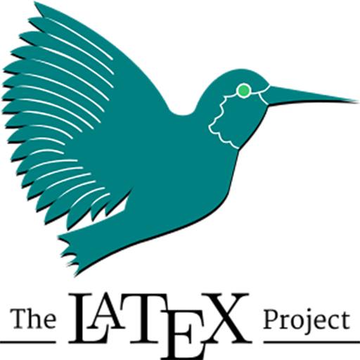
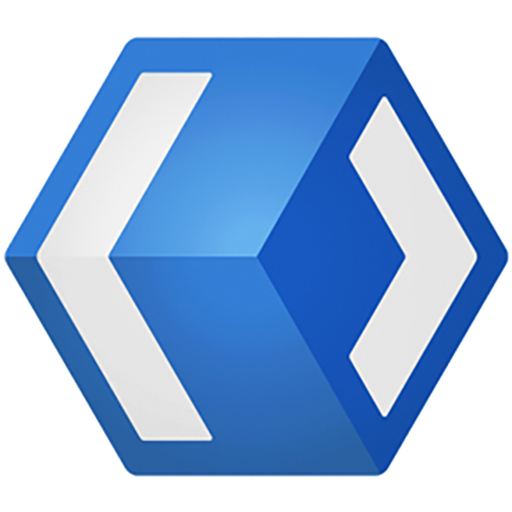
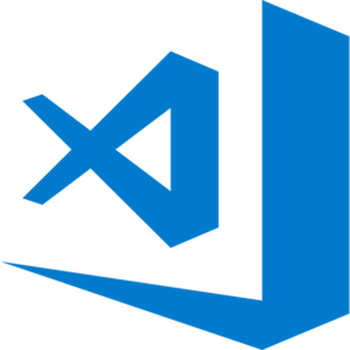
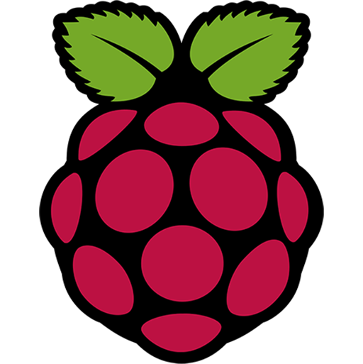

# Hi there 👋 I'm [司晓龙 | SI-Xiaolong](https://about.sixiaolong.win/)

  

    
  

	

- Undergraduate student (Material Science and Engineering) at North China University of Technology (NCUT) (Class of 2024).
- Preparing NPEE.

---

### 🔭Work

- [远程工具箱 (Remote Toolbox)](https://github.com/SIXiaolong1117/WinWoL)
- [网关切换器 (Gateway Switcher)](https://github.com/SIXiaolong1117/NetworkSelector)
- [图片转 Base64（Pic to Base64）](https://github.com/SIXiaolong1117/vue-pictobase64)
- [See My Server](https://www.microsoft.com/store/productId/9MTGBS9PTCH8)

	

---

### 🪛Language

<code></code>
<code></code>
<code></code>
<code></code>
<code></code>
<code></code>
<code></code>
<code></code>
<code></code>

### 🔧Framework

<code></code>
<code></code>
<code></code>

### 🧰Tools and Environment

<code></code>
<code></code>
<code></code>

### ⚙️Operating System

<code></code>
<!-- <code></code> -->
<code></code>
<code></code>

### 🔨Hardware

<code></code>
<code></code>
<code></code>

